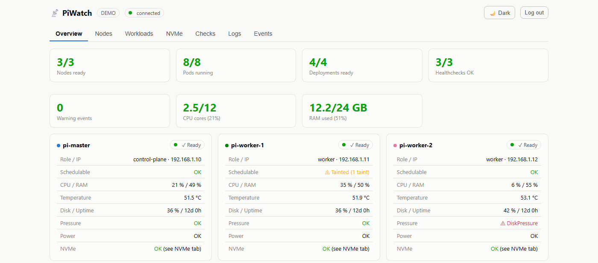
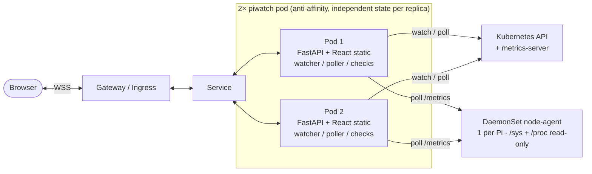

# 📡 PiWatch – k3s monitoring dashboard for Raspberry Pi

[](https://github.com/lukislp/piwatch/actions/workflows/ci-cd.yml)
[](https://github.com/lukislp/piwatch/releases)
[](LICENSE)
[](https://www.python.org/)
[](https://github.com/lukislp/piwatch/actions/workflows/ci-cd.yml)

Self-hosted real-time monitoring for a k3s cluster: **FastAPI backend** +
**React frontend** in a single container, live updates over **WebSocket**,
highly available with **2 replicas** (a node goes down ⇒ the second replica
takes over, the frontend reconnects automatically).

**[Live demo](https://piwatch-demo.lktec.org)** — running the actual
`ghcr.io/lukislp/piwatch:latest` image published by this repo's own CI/CD pipeline, in its
built-in demo mode (`PIWATCH_DEMO=1`): a simulated 3-node Raspberry Pi cluster with
live-changing CPU/memory/temperature/disk metrics, pods, deployments, and events - no real
cluster involved.



## Features

- **Kubernetes live**: nodes, pods, deployments, StatefulSets, DaemonSets, events via the watch
  API (no polling). StatefulSets/DaemonSets get their own rollout-in-progress indicator, from
  their own native status fields (no pod-naming heuristic needed there, unlike Deployments)
- **Rollout drift detection**: flags a Deployment when its replicas haven't all updated yet, or
  are running different image tags (best-effort pod-to-Deployment match by naming convention --
  PiWatch doesn't watch ReplicaSets/ownerReferences)
- **OOMKilled detection**: flags a pod in the Workloads table when a container was killed for
  exceeding its memory limit, even after kubelet already restarted it back to Running
- **Restart reason on hover**: the Workloads table's Restarts count shows the last container
  termination reason and exit code as a tooltip (e.g. `Error (exit 1)`) -- current state takes
  priority, falling back to `last_state` when kubelet already restarted the container
- **Init container failure detail**: a pod stuck starting up shows `Init: 1/2` plus the
  blocking container's specific reason (e.g. `CrashLoopBackOff`, `ImagePullBackOff`) --
  otherwise only visible as the generic `PodInitializing` on the main containers
- **Node pressure conditions**: the Overview page's node cards show a Pressure indicator
  (MemoryPressure/DiskPressure/PIDPressure) -- an earlier warning than waiting for the node to
  go NotReady entirely
- **Node cordon/taint indicator**: a Schedulable row on each node card flags a cordoned
  (`kubectl drain`/`cordon`) or tainted node -- otherwise indistinguishable from a normal
  Ready node at a glance
- **Per-pod CPU/RAM usage**: live usage per pod/workload via metrics-server, right in the Workloads table
- **Pi hardware**: CPU temperature, load, RAM, disk, uptime per node (DaemonSet agent)
- **NVMe + power health**: dedicated NVMe tab per node -- temperature, model, firmware,
  serial, capacity, wear %/spare capacity, power-on hours, power cycles, unsafe shutdowns,
  total data read/written, host command counts, error counts, and live read/write
  throughput charts. Plus the Pi firmware's under-voltage (bad PSU/PoE) flag, surfaced as a
  plain OK/error indicator on the Overview page
- **Metrics**: CPU/RAM usage via metrics-server (bundled with k3s), ~3h history
- **Persistent history** (optional, set `PIWATCH_HISTORY_DB`): the ~3h chart window survives
  a pod restart instead of starting empty, backed by a local SQLite file. Bounded, not
  unlimited -- rows older than `PIWATCH_HISTORY_RETENTION_DAYS` (default 7) are pruned
  periodically. Storage is node-local (hostPath), one file per replica, not a shared PVC --
  see the comment in `deploy/deployment.yaml` for why
- **Cluster capacity overview**: two Overview tiles showing total CPU cores and RAM used
  vs. allocatable across all nodes, so you can see headroom before a pod fails to schedule
- **Network throughput** per node (RX/TX), summed across physical interfaces only
- **GitOps sync status** (optional): if you run [Flux](https://fluxcd.io/), a "GitOps" card on the
  Overview page shows each Kustomization's Ready condition, last applied revision, managed
  resource count, an apply-in-progress/stuck indicator, a countdown to the next reconcile, and
  its Git source's sync status. If Flux's image-automation controllers are installed, a second
  card shows each image policy's latest/previous tag and scan time plus each automation's last
  run and last Git push -- and the tag actually running right now (best-effort match against
  Deployment images by repository), highlighted when it's behind the latest scanned tag. Not a
  hard dependency -- stays hidden if Flux (or image automation) isn't installed
- **Network tab**: a dedicated page for everything routing/policy-related, kept off Overview
  so the "is everything OK" glance stays scannable:
  - **Gateway API routing status** (optional): if you route traffic through the
    [Gateway API](https://gateway-api.sigs.k8s.io/), a "Gateway API" card shows each Gateway's
    Programmed status, assigned address and listener count, plus each HTTPRoute's
    accepted/backend-resolved status -- catches a route pointing at a Service that doesn't
    exist or doesn't match, a failure mode invisible from the Deployment/Pod view alone. Not a
    hard dependency -- stays hidden if you don't use the Gateway API
  - **Rate limit policies**: if you're on [NGINX Gateway Fabric](https://github.com/nginx/nginx-gateway-fabric),
    a "Rate Limit Policies" card lists every `RateLimitPolicy` with its target route,
    configured limits and Accepted status. Stays hidden if you don't use any -- this is an
    NGINX Gateway Fabric extension, not part of the standard Gateway API
  - **LoadBalancer Service status**: lists every `type: LoadBalancer` Service with its
    cluster/external IP and ports, flagging any still stuck waiting for an address (e.g. no
    free IP left in your MetalLB pool). Stays hidden if you don't run any
  - **Network Policies**: lists every NetworkPolicy with its pod selector, Ingress/Egress
    types and rule counts -- a quick overview of what's restricted where, without
    `kubectl get networkpolicy -A` across every namespace. Stays hidden if you don't use any
- **PVC storage usage**: a "Storage" card on the Workloads page lists every PersistentVolumeClaim
  with its status, storage class and capacity. Usage % additionally needs
  [Prometheus](https://prometheus.io/) scraping kubelet (set `PIWATCH_PROMETHEUS_URL`) -- without
  it, the card still shows capacity/binding metadata, just no usage column. Note: storage classes
  without real per-volume quotas (e.g. `local-path-provisioner`, k3s's own default) can't report
  meaningful usage at all -- kubelet falls back to the underlying node disk's stats instead, so
  PiWatch detects and discards that case too (usage stays blank rather than showing a
  wrong number)
- **Orphaned PersistentVolume detection**: a Workloads-page card lists any PersistentVolume
  stuck in `Released` or `Failed` phase -- storage left behind after its PVC was deleted (common
  with a `Retain` reclaim policy) that nothing else surfaces. Hidden entirely when there aren't any
- **Autoscaler status**: an "Autoscalers" card on the Workloads page lists every
  HorizontalPodAutoscaler with its target, current/min/max replicas and current vs. target
  CPU/memory utilization, flagging one that's hit its scaling limit or can't scale at all.
  Hidden entirely if you don't use HPAs
- **CoreDNS healthcheck** (always on): resolves a well-known in-cluster DNS name every 30s
  using the pod's own resolver, catching a classic, otherwise invisible failure mode --
  cluster DNS being broken or slow. Needs no RBAC and no configuration; shows up on the
  Checks page like any other check
- **HTTP/TCP healthchecks** for your own services (Home Assistant, MQTT, …) with uptime history
- **Auto-discovered healthchecks** (optional, set `PIWATCH_AUTO_HEALTHCHECKS=1`): a check for
  every accepted HTTPRoute (HTTP(S) request straight to its Gateway's Service ClusterIP, with
  the correct TLS SNI/`Host` header for that hostname -- never the public hostname, which usually
  isn't reachable from inside the cluster's own pod network) and every `type: LoadBalancer`
  Service (plain TCP reachability per port). Zero YAML to write; runs additively alongside any
  checks already configured via `PIWATCH_CHECKS_FILE`, and updates live as routes/Services
  come and go -- no restart needed
- **Live logs** for any pod, right in the browser
- **Simple auth**: password from a Kubernetes Secret, signed tokens (failover-friendly)
- **Dark/light mode**

## Architecture



Each replica keeps its own state in RAM (stateless externally, no shared
storage, no leader election). Tokens from both replicas are interchangeable
because both use the same Secret.

## Try it locally (no cluster needed)

```bash
cd backend && pip install -r requirements.txt
PIWATCH_DEMO=1 uvicorn app.main:app --port 8000
# Frontend dev server (optional, with proxy):
cd ../frontend && npm install && npm run dev
```

Without `PIWATCH_PASSWORD`, login is disabled.

## Deploying to your own cluster

The manifests in `deploy/` are written for a 2-node k3s cluster and route
through the [Gateway API](https://gateway-api.sigs.k8s.io/) (`httproute.yaml`,
tested with NGINX Gateway Fabric). If you're on ingress-nginx or another
controller, swap `httproute.yaml`/`RateLimitPolicy` for an `Ingress` resource
and adjust `deploy/kustomization.yaml` accordingly.

Before deploying, adjust the hostnames in `deploy/httproute.yaml` to point at
your own domains.

1. **Image**: the manifests in `deploy/` reference `registry.example.com/your-namespace/piwatch:latest`
   as a placeholder — for a stock, unmodified deployment, just point them at
   the multi-arch image this repo's own CI/CD pipeline already builds and
   publishes on every release, `ghcr.io/lukislp/piwatch:latest` (or a pinned
   `:X.Y.Z` version tag). You only need to build your own image if you've
   forked or modified the code:
   ```bash
   docker buildx build --platform linux/arm64,linux/amd64 \
     -t your-registry/your-namespace/piwatch:latest --push .
   ```
   Either way, running pods need a restart to pull a newly-pushed `:latest`
   (`imagePullPolicy: Always` picks it up automatically, but won't force a
   restart on its own): `kubectl -n monitoring rollout restart
   deployment/piwatch daemonset/piwatch-node-agent`.

2. **Create the Secret** — `.\create-secret.ps1` (interactively asks only for
   the login password, generates the signing key automatically at random,
   creates the Secret directly on the cluster via `kubectl` — it never
   touches disk as a plaintext file). The alternative, file-based approach
   (`cp deploy/secret.example.yaml deploy/secret.yaml` + uncomment the
   `- secret.yaml` line in `deploy/kustomization.yaml`) still works but is
   **not** recommended, since the Secret then sits unencrypted on disk. For a
   Secret that's safe to commit to Git, seal it with
   [Sealed Secrets](https://github.com/bitnami-labs/sealed-secrets) instead
   (see the comment in `deploy/kustomization.yaml`).

3. **Roll it out** (point `KUBECONFIG` at your cluster's kubeconfig):
   ```bash
   kubectl apply -k deploy/
   kubectl -n monitoring get pods -o wide   # 2× piwatch across 2 nodes + node-agents
   ```

4. **Access**: whichever hostnames you configured in `deploy/httproute.yaml`
   (e.g. an internal `.lan` name plus a public domain behind your reverse proxy).

## NVMe SMART needs a privileged node-agent

The NVMe temperature, model and capacity fields work from plain, unprivileged sysfs
reads. Full SMART data (wear %, power-on hours, media errors, ...) additionally needs
`nvme-cli` and access to the NVMe admin character device -- that ioctl is gated by the
kernel regardless of file permissions, so `deploy/daemonset-node-agent.yaml` runs the
node-agent container with `privileged: true` and a `/dev` mount for this. That's a
materially bigger privilege footprint than the rest of the agent (everything else is
read-only sysfs/procfs). If you'd rather not grant it, remove `privileged: true` and the
`dev` volume/mount -- temperature, model, capacity and the under-voltage flag keep
working, only the SMART fields go missing.

## Testing failover

```bash
kubectl drain <node-running-a-piwatch-pod> --ignore-daemonsets --delete-emptydir-data
```

The dashboard stays reachable: the browser reconnects automatically and gets
the full state from the surviving replica. Afterwards:
`kubectl uncordon <node>`.

## Tests

```bash
cd backend && python -m pytest tests/
```

## Configuration (environment variables)

| Variable | Meaning | Default |
|---|---|---|
| `PIWATCH_PASSWORD` | Login password (empty = auth disabled) | – |
| `PIWATCH_SECRET` | Token signing key (must match across replicas) | derived |
| `PIWATCH_TOKEN_TTL` | Token validity in seconds | 43200 |
| `PIWATCH_DEMO` | `1` = demo mode with fake data | – |
| `PIWATCH_CHECKS_FILE` | Path to the healthcheck YAML | `/config/healthchecks.yaml` |
| `PIWATCH_AGENT_SERVICE` | Headless service for the node-agents | `piwatch-node-agent.monitoring…` |
| `PIWATCH_AGENT_PORT` | Port the node-agents listen on | `9101` |
| `PIWATCH_PROMETHEUS_URL` | Prometheus base URL, for PVC usage % (optional) | – |
| `PIWATCH_AUTO_HEALTHCHECKS` | `1` = auto-generate checks from HTTPRoutes/LoadBalancer Services | – |
| `PIWATCH_HISTORY_DB` | Path to a SQLite file for persistent node history (optional) | – |
| `PIWATCH_HISTORY_RETENTION_DAYS` | Max age of persisted history rows before pruning | `7` |

## Deliberate simplifications

- History defaults to RAM-only (~3h, resets on pod restart); `PIWATCH_HISTORY_DB` makes
  it survive restarts (see above), but there's still no historical drill-down UI beyond
  the live chart window.
- No alerting (push/mail) — the pub/sub structure is prepared for it.

## License

[MIT](LICENSE)
